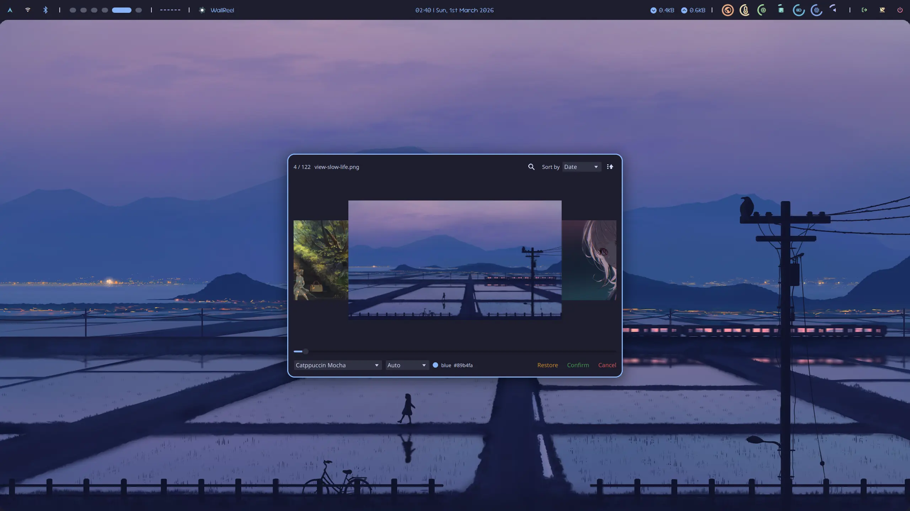

## What this is

It might be a bit overkill to build a Qt application from ground for such a small feature, but I kind of enjoy the pain... So here it is.



## How to build

1. Make sure Qt6 libraries, CMake, and a C++ compiler are installed.

   On Arch-based systems:

   ```bash
   sudo pacman -S --needed qt6-base qt6-declarative cmake gcc
   ```

   On Debian-based systems:

   ```bash
   sudo apt install --no-install-recommends qt6-base-dev qt6-declarative-dev qml6-module-qtquick qml6-module-qtquick-controls2 qml6-module-qtquick-layouts qml6-module-qtquick-templates qml6-qtqml-workerscript cmake g++
   ```

2. Clone the repository:

   ```bash
   git clone https://github.com/Uyanide/WallReel.git && \
   cd WallReel
   ```

3. Build and install:

   This is a standard CMake project. First, configure it. Adjust the install prefix as needed.

   ```bash
   cmake -S . -B build -DCMAKE_INSTALL_PREFIX=/usr/local
   ```

   Then build.

   ```bash
   cmake --build build -- -j$(nproc)
   ```

   The binary will be located at `build/wallreel` and can be run directly for testing.

   ```bash
   build/wallreel
   ```

   Install to the configured prefix. This step may require root permissions if the prefix is set to a system path such as `/usr/local`.

   ```bash
   cmake --install build --strip
   ```

   `--strip` reduces binary size by removing symbol information that is usually unnecessary for normal usage.

## Man Pages

This project ships man pages and installs them through `cmake --install`.

- `wallreel(1)` for CLI usage
- `wallreel(5)` for configuration

The source files are maintained in Markdown for easier editing:

- `docs/man/man.1.md`
- `docs/man/man.5.md`

Generated man files are committed for packaging and normal installation without extra tool dependencies:

- `WallReel/Assets/man/man.1`
- `WallReel/Assets/man/man.5`

To regenerate them, run:

```bash
for src in docs/man/man.*.md; do
    dst="WallReel/Assets/man/$(basename "${src%.md}")"
    pandoc --from gfm --to man --standalone -o "$dst" "$src"
done
```

## Configuration Reference

Refer to [config.schema.json](config.schema.json) for a complete reference of the configuration file schema. Below is a summary of the available options.

The configuration file is divided into five main sections: `wallpaper`, `theme`, `action`, `style`, and `cache`.

### Wallpaper (`wallpaper`)

Defines where WallReel looks for images and what to exclude. If none of the `paths` or `dirs` are specified, the application will default to searching the user's Pictures directory (recursively) and consider all supported image files as wallpapers (which could create a huge cache and take a long time to process if you have a lot of images).

| Property   | Type             | Default | Description                                                                                            |
| :--------- | :--------------- | :------ | :----------------------------------------------------------------------------------------------------- |
| `paths`    | Array of Strings | `[]`    | Exact paths to specific image files.                                                                   |
| `dirs`     | Array of Objects | `[]`    | Directories to search for images. Each object should have a `path` (string) and `recursive` (boolean). |
| `excludes` | Array of Strings | `[]`    | Exclude patterns using Regular Expressions.                                                            |

### Theme (`theme`)

Configures the color palettes.

By default, a **dominant color** is extracted from each wallpaper. If a palette is **selected**, the closest palette color is used as the **primary color**. This is useful when you want your desktop theme to follow a predefined palette (for example Catppuccin or Tokyo Night) instead of generating a custom one (for example with matugen).

Several embedded palettes are available, including "Catppuccin Frappe", "Catppuccin Latte", "Catppuccin Macchiato", and "Catppuccin Mocha". You can also define custom palettes or override embedded ones via configuration.

| Property   | Type             | Default | Description                                                                                                                                 |
| :--------- | :--------------- | :------ | :------------------------------------------------------------------------------------------------------------------------------------------ |
| `palettes` | Array of Objects | `[]`    | List of defined palettes. Each contains a `name` (string) and an array of `colors` (each with a `name` and a hex `value` like `"#ff0000"`). |

### Action (`action`)

Configures system commands to execute on specific events mapping to your window manager or wallpaper utility (e.g., `swaybg`, `feh`).

| Property              | Type             | Default | Description                                                                                                                                                          |
| :-------------------- | :--------------- | :------ | :------------------------------------------------------------------------------------------------------------------------------------------------------------------- |
| `previewDebounceTime` | Integer          | `300`   | Debounce time (ms) for triggering the preview action.                                                                                                                |
| `printSelected`       | Boolean          | `true`  | Print selected wallpaper path to stdout on confirm.                                                                                                                  |
| `printPreview`        | Boolean          | `false` | Print previewed wallpaper path to stdout on preview.                                                                                                                 |
| `onSelected`          | String           | `""`    | Command to execute when a wallpaper is confirmed.                                                                                                                    |
| `onPreview`           | String           | `""`    | Command to execute when a wallpaper is previewed.                                                                                                                    |
| `saveState`           | Array of Objects | `[]`    | Commands to fetch system states before changing wallpapers. Each object defines: `key`, `fallback` (fallback value), `command` (stdout mapping), and `timeout` (ms). |
| `onRestore`           | String           | `""`    | Command to execute on restore. Extracted states from `saveState` can be injected using `{{ key }}`.                                                                  |
| `quitOnSelected`      | Boolean          | `false` | Quit the application after a selection is made.                                                                                                                      |
| `restoreOnClose`      | Boolean          | `true`  | Run `onRestore` command if the application is closed without making a final selection.                                                                               |

Available placeholders for `onSelected`, `onPreview` commands:

| Placeholder         | Description                                                                                |
| :------------------ | :----------------------------------------------------------------------------------------- |
| `{{ path }}`        | Full path of the selected or previewed wallpaper.                                          |
| `{{ name }}`        | Filename of the selected or previewed wallpaper.                                           |
| `{{ size }}`        | Size of the selected or previewed wallpaper in bytes.                                      |
| `{{ palette }}`     | Name of the currently selected color palette. ("null" if none)                             |
| `{{ colorName }}`   | Name of the currently determined primary color. ("null" if none)                           |
| `{{ colorHex }}`    | Hex code (starting with "#") of the currently determined primary color. ("null" if none)   |
| `{{ domColorHex }}` | Hex code (starting with "#") of the dominant color in the selected or previewed wallpaper. |
| `{{ <key> }}`       | Value of the saved state with the specified key.                                           |

### Style (`style`)

Controls the layout and dimensions of the application window and image items.

| Property            | Type    | Default | Description                              |
| :------------------ | :------ | :------ | :--------------------------------------- |
| `image_width`       | Integer | `320`   | Width of each thumbnail.                 |
| `image_height`      | Integer | `180`   | Height of each thumbnail.                |
| `image_focus_scale` | Number  | `1.5`   | Scale multiplier for focused thumbnails. |
| `window_width`      | Integer | `750`   | Initial application window width.        |
| `window_height`     | Integer | `500`   | Initial application window height.       |

### Cache (`cache`)

Controls what UI state is persisted between sessions.

| Property          | Type    | Default | Description                                                                   |
| :---------------- | :------ | :------ | :---------------------------------------------------------------------------- |
| `saveSortMethod`  | Boolean | `true`  | Whether to persist the sort type and order.                                   |
| `savePalette`     | Boolean | `true`  | Whether to persist the selected palette.                                      |
| `maxImageEntries` | Integer | `1000`  | Maximum number of entries in the image cache (older entries will be evicted). |

---

## Example `config.json`

```json
{
  "$schema": "https://raw.githubusercontent.com/Uyanide/WallReel/refs/heads/master/config.schema.json",
  "wallpaper": {
    "paths": ["/home/user/Pictures/favorite.jpg"],
    "dirs": [
      {
        "path": "/home/user/Pictures/Wallpapers",
        "recursive": true
      }
    ],
    "excludes": ["\\.gif$"]
  },
  "theme": {
    "palettes": [
      {
        "name": "Dark",
        "colors": [
          { "name": "blue", "value": "#89b4fa" },
          { "name": "red", "value": "#f38ba8" }
        ]
      }
    ]
  },
  "action": {
    "previewDebounceTime": 500,
    "quitOnSelected": true,
    "onPreview": "swww img {{ path }}",
    "onSelected": "cp {{ path }} ~/.config/wallpaper/current/ && swww img {{ path }}",
    "saveState": [
      {
        "key": "current_wp",
        "fallback": "/home/user/Pictures/default.jpg",
        "command": "find ~/.config/wallpaper/current -type f | head -n 1",
        "timeout": 1000
      }
    ],
    "onRestore": "swww img {{ current_wp }}"
  },
  "style": {
    "image_width": 640,
    "image_height": 400,
    "image_focus_scale": 1.2,
    "window_width": 1280,
    "window_height": 720
  },
  "cache": {
    "saveSortMethod": true,
    "savePalette": true,
    "maxImageEntries": 300
  }
}
```

## CLI

```text
Usage: wallreel [options]

Options:
  -h, --help                 Displays help on commandline options.
  -v, --version              Displays version information.
  -V, --verbose              Set log level to DEBUG (default is INFO)
  -C, --clear-cache          Clear the image cache and exit
  -q, --quiet                Suppress all log output
  -d, --append-dir <dir>     Append an additional wallpaper search directory
  -c, --config-file <file>   Specify a custom configuration file
  -D, --disable-actions      Disable actions set in configuration file
  -a, --apply <file>         Apply the specified image as wallpaper and exit
```

A few things to notice:

- In most cases you do not need CLI arguments; configuration is usually the better place to customize behavior. CLI flags are still useful for quick overrides and one-shot runs though.

- The `--append-dir` option can be used multiple times to add multiple directories.

- It is quite obvious that some options conflicts with each other (e.g. `--verbose` and `--quiet`). Case mutually exclusive options are provided together, the behavior is un.. just please, don't do that.

- With `--apply`, WallReel still parses the configuration (default path or `--config-file`) and executes `onSelected` with placeholders resolved from the specified image. If `savePalette` is enabled and a palette was selected in the last session, `palette`, `colorName`, and `colorHex` placeholders are also available. `saveState` commands are executed as well. The application exits immediately after executing the action, without opening the UI. This mode allows WallReel to be used as a command-line wallpaper setter with palette-aware theming and state placeholders.
